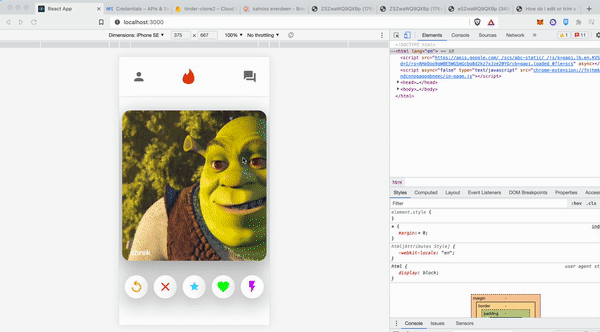

# Tinder App!

## Using React 

### Firebase (real-time database)

### Material-UI for the design (front-end)

# Functionality
Swiping if funny functional
messaging UI
Real-time updating of people cards from database entries 

